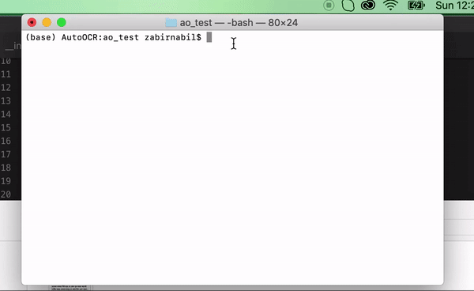

# autoocr
> A Python wrapper for cross platform tesseract OCR engine with multiple languages (e.g. Bangla)

## Installations

```
pip3 install autoocr
```

## Usage

### Mac OS

* Import the library

```
from autoocr import AutoOCR # import the AutoOCR class
```

* Specify the language

```
oa = AutoOCR(lang='bangla') # specify the language code
```
* Set the tessdata folder, on mac you can do `brew list tesseract` to get the path. This is only needed once.

```
oa.set_datapath('/usr/local/Cellar/tesseract/4.0.0_1/share/tessdata')
```
* Get the text from image by passing the path to image

```
out_text = oa.get_text('image_ocr.jpg')
```

[](https://www.youtube.com/channel/UCVaObCskAlvvctDP9vZvW6w)


### Windows

* Install tesseract engine

* Import the library

```
from autoocr import AutoOCR # import the AutoOCR class
```

* Specify the language

```
oa = AutoOCR(lang='bangla') # specify the language code
```
* Set the tessdata folder. This is only needed once.

```
oa.set_datapath('/path/to/tessdata')
```
* Get the text from image by passing the path to image

```
out_text = oa.get_text('image_ocr.jpg')
```


### Linux

* Install tesseract engine. Follow this page [](https://github.com/tesseract-ocr/tesseract/wiki)

* Import the library

```
from autoocr import AutoOCR # import the AutoOCR class
```

* Specify the language

```
oa = AutoOCR(lang='bangla') # specify the language code
```
* Set the tessdata folder. This is only needed once. Run, `rpm -ql tesseract` for yum to get the location.

```
oa.set_datapath('/path/to/tessdata')
```
* Get the text from image by passing the path to image

```
out_text = oa.get_text('image_ocr.jpg')
```


## License

This project is licensed under the MIT License - see the [LICENSE](LICENSE) file for details.

[](https://opensource.org/)